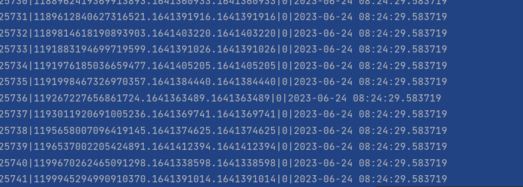

# ml_cars
Описание проекта
Проект ml_cars является курсовой работой выполненной на базе Анализ сайта «СберАвтоподписка»
Целью проекта является создание структуры хранения и обработки входящих данных для предсказания на основе разработанной модели

## Установка
Для запуска airflow выполните следующую команду:
```bash
docker-compose up --build -d
```
Создание базы данных:
```bash
docker exec -it <airflow-webserver_container_name> /bin/bash -c "cd / && ./entrypoint.sh && exit"
```
Короткое описание модели:
CatBoostClassifier - градиентный бустинговый алгоритм, который предназначен для решения задач классификации.

Описание дагов:
В проекте использованы 4 дага:
predict - обрабатывает входящие json-файлы и записывает обработанный результат в новый файл json.
predict_db - обрабатывает входящие json-файлы и записывает обработанный результат в базу данных.
predict_pipeline - обрабатывает входящие csv-файлы и записывает обработанный результат в новый файл csv.
predict_pipeline_db - обрабатывает входящие csv-файлы и записывает обработанный результат в базу данных.

Airflow:
Откройте веб-браузер и перейдите по адресу http://localhost:8080, чтобы открыть веб-интерфейс Airflow.

Описание баз данных:
 
